<style>
@import './style.css';
</style>

# Majestic Marketplace

### AI-Powered Engineering Workflows for Claude Code

<div class="pt-12">
  <span class="px-2 py-1 rounded cursor-pointer" hover="bg-white bg-opacity-10">
    For Experienced Software Engineers
  </span>
</div>

<div class="abs-br m-6 flex gap-2">
  <a href="https://github.com/majesticlabs-dev/majestic-marketplace" target="_blank" alt="GitHub" title="View on GitHub"
    class="text-xl slidev-icon-btn !border-none text-black bg-white rounded-full p-2 hover:bg-gray-100">
    <carbon-logo-github />
  </a>
</div>

---
layout: two-cols
layoutClass: gap-16
---

# What You'll Learn

<v-clicks>

- **Installation** - Get started in 2 minutes
- **Core Workflow** - Plan → Build → Review → Ship
- **Four Key Plugins**
  - `majestic-engineer` - Orchestration hub
  - `majestic-rails` - Rails specialization
  - `majestic-experts` - Expert panel discussions
  - `majestic-tools` - Meta utilities
- **Configuration** - `.agents.yml` customization
- **Real Examples** - Practical usage patterns

</v-clicks>

::right::

<div class="mt-12">

```yaml {all|1-2|4-8|10-14}
# .agents.yml
tech_stack: rails

# Quality Gate
quality_gate:
  reviewers:
    - security-review
    - pragmatic-rails-reviewer

# Workflow
workflow: worktrees
task_management: github
branch_naming: type/issue-desc
```

</div>

---
layout: section
---

# Part 1
## Installation & Setup

---

# Quick Installation

<v-clicks>

### 1. Add the Marketplace

```bash
claude /plugin marketplace add majesticlabs-dev/majestic-marketplace
```

### 2. Install the Plugins

```bash
# Core orchestration (required)
claude /plugin install majestic-engineer

# Rails development (if Rails project)
claude /plugin install majestic-rails

# Meta tools (optional but recommended)
claude /plugin install majestic-tools
```

### 3. Initialize Your Project

```bash
# Creates AGENTS.md + .agents.yml
claude /majestic-engineer:workflows:init-agents-md
```

</v-clicks>

---

# Project Configuration

<div class="grid grid-cols-2 gap-8">
<div>

### `.agents.yml` - Machine-Readable

```yaml
# Core
default_branch: main
tech_stack: rails
app_status: development

# Rails-specific
ruby_version: "3.4.1"
rails_version: "8.0"
database: sqlite
frontend: hotwire

# Workflow
task_management: github
workflow: worktrees
branch_naming: type/issue-desc
```

</div>
<div>

### Why Two Files?

<v-clicks>

| File | Purpose |
|------|---------|
| `AGENTS.md` | Human guidance for Claude |
| `.agents.yml` | Machine config for commands |

**Key Benefits:**
- Commands read config programmatically
- `grep "key:" .agents.yml` just works
- Local overrides via `.agents.local.yml`
- Single source of truth

</v-clicks>

</div>
</div>

---
layout: section
---

# Part 2
## The Core Workflow

---

# Plan → Build → QA → Ship

```mermaid {scale: 0.8}
graph LR
    A[📝 Plan] --> B[🔨 Build]
    B --> C[🔍 Review]
    C --> D{Approved?}
    D -->|Yes| E[🚀 Ship]
    D -->|No| B

    style A fill:#818cf8,color:#fff
    style B fill:#34d399,color:#000
    style C fill:#fbbf24,color:#000
    style D color:#fff
    style E fill:#f472b6,color:#fff

    linkStyle default stroke:#fff,stroke-width:2px
```

<div class="text-center">



</div>

<v-clicks>

## Recommended: Autonomous Workflow

| Phase | Command | What Happens |
|-------|---------|--------------|
| **Plan** | `/majestic-engineer:workflows:plan` | Research → Design → Create plan |
| **Build** | `/majestic-engineer:workflows:build-task` | Implement → Test → Auto QA |
| **Ship** | `/majestic-engineer:workflows:ship-it` | Lint → Commit → PR |

**Key benefit**: Quality Gate runs automatically - reviewers in parallel, auto-fix (3 retries)

**Alternative**: Manual code → `/majestic-engineer:workflows:code-review --staged` → Ship

</v-clicks>

---

# Planning: The Foundation

<div class="grid grid-cols-2 gap-4">
<div>

### `/majestic-engineer:workflows:plan "add user authentication"`

<v-clicks>

**What it does:**
1. Researches best practices (web search)
2. Analyzes existing codebase
3. Designs implementation approach
4. Creates `docs/plans/user-authentication.md`

**The plan includes:**
- Problem statement
- Research findings
- Implementation steps
- Test strategy
- Risks & mitigations

</v-clicks>

</div>
<div>

### Example Output

```markdown
# Plan: User Authentication

## Research
- Rails 8 auth: built-in `has_secure_password`
- Industry: OAuth2 + email/password hybrid common

## Implementation
1. Add User model with `has_secure_password`
2. Create SessionsController (7 actions max)
3. Add Current.user for request context
4. Implement remember me with signed cookies

## Tests
- Model: validation, authentication
- Integration: login flow, session expiry

## Risks
- Password reset: needs mailer setup first
```

</div>
</div>

---

# Building: The Build Loop

<div class="text-center">


</div>

---

# Building: `/majestic-engineer:workflows:build-task`

<div class="grid grid-cols-2 gap-4">
<div>

### Command

```bash
/majestic-engineer:workflows:build-task #123
```

**Autonomous workflow:**
1. Fetches task (GitHub/Linear/Beads)
2. Creates workspace (branch/worktree)
3. Plans implementation
4. Implements & tests changes
5. Removes AI slop
6. **Quality Gate** review
7. Auto-fixes issues
8. Ready for manual review/shipping

</div>
<div>

### Configuration

**`.agents.yml` controls:**
- Task management system
- Workflow (branches vs worktrees)
- Quality gate reviewers

**Quality Gate runs automatically:**
- All reviewers in parallel
- Up to 3 fix retries
- Tech-stack aware

</div>
</div>

---

# Quality Gate: Automatic Code Review

<div class="grid grid-cols-2 gap-4">
<div>

### Configuration in `.agents.yml`

```yaml
# Quality Gate
quality_gate:
  reviewers:
    - security-review      # OWASP scanning
    - test-reviewer        # Coverage checks
    # Optional:
    - simplicity-reviewer  # YAGNI enforcement
    # Framework-specific (if rails/python):
    - pragmatic-rails-reviewer
    - python-reviewer
```

<v-clicks>

**How it works:**
- Runs automatically during build-task workflow
- All reviewers execute **in parallel**
- Framework-specific reviewers auto-selected based on `tech_stack`

</v-clicks>

</div>
<div>

### Example Review Output

```
## Quality Gate Results

### CRITICAL (must fix immediately)
- security-review: Hardcoded credentials in config/
  Use environment variables or encrypted credentials

### HIGH (must fix before shipping)
- test-reviewer: No tests for new UserService
  Add unit tests with edge case coverage

### MEDIUM (should fix)
- simplicity-reviewer: Premature abstraction
  Remove ConfigBuilder, use direct hash

**Verdict: NEEDS CHANGES (1 CRITICAL, 1 HIGH)**
```

</div>
</div>

---

# Shipping: The Final Mile

<div class="grid grid-cols-2 gap-4">
<div>

### `/majestic-engineer:workflows:ship-it`

<v-clicks>

**Automated steps:**
1. Runs linter
2. Stages changes
3. Creates conventional commit
4. Pushes to remote
5. Opens PR with summary

**Commit format:**
```
feat(auth): add user authentication

- User model with has_secure_password
- SessionsController with 7 REST actions
- Current.user for request context
- Integration tests for login flow
```

</v-clicks>

</div>
<div>

### Or Step by Step

```bash
# Just commit
/majestic-engineer:git:commit

# Just create PR
/majestic-engineer:git:create-pr

# Full flow
/majestic-engineer:workflows:ship-it
```

<v-click>

### PR Template

```markdown
## Summary
- Add user authentication with email/password
- Implement session management
- Add remember me functionality

## Test plan
- [ ] User can sign up with valid email
- [ ] User can log in with correct password
- [ ] Session persists across requests
- [ ] Remember me extends session
```

</v-click>

</div>
</div>

---
layout: section
---

# Part 3
## majestic-engineer
### The Orchestration Hub

---

# Architecture Overview

<div class="text-center">


</div>

---

# Key Commands

| Command | Purpose | When to Use |
|---------|---------|-------------|
| `/majestic-engineer:workflows:plan "desc"` | Create implementation plan | Starting any feature |
| `/majestic-engineer:workflows:prd "product"` | Generate PRD document | Defining new products |
| `/majestic-engineer:workflows:guided-prd` | Conversational PRD creation | Fuzzy requirements |
| `/majestic-engineer:workflows:build-task #123` | Autonomous task implementation | GitHub/Linear/Beads tasks |
| `/majestic-engineer:workflows:code-review` | Tech-stack aware review | Quality checks |
| `/majestic-engineer:workflows:debug "error"` | Systematic debugging | Troubleshooting |
| `/majestic-engineer:workflows:design-plan` | UI/UX design planning | Design-focused work |
| `/majestic-engineer:git:commit` | Conventional commits | Ready to commit |
| `/majestic-engineer:git:create-pr` | PR with template | Opening reviews |
| `/majestic-engineer:session:handoff` | Create handoff document | Pausing work |
| `/majestic-engineer:session:pickup` | Resume from handoff | Continuing later |

---

# Key Agents

<div class="grid grid-cols-2 gap-4">
<div>

### Planning & Design

| Agent | Use When |
|-------|----------|
| `architect` | Complex feature design |
| `plan-review` | Validate plans before building |
| `spec-reviewer` | Analyze specs for gaps |

### Research

| Agent | Use When |
|-------|----------|
| `web-research` | Need internet info |
| `git-researcher` | Code history questions |
| `docs-researcher` | Library documentation |
| `repo-analyst` | Onboarding to new repo |

</div>
<div>

### Quality Assurance

| Agent | Use When |
|-------|----------|
| `security-review` | Check for vulnerabilities |
| `test-create` | Generate tests |
| `test-reviewer` | Validate test quality |
| `slop-remover` | Clean AI-generated code |

### Workflow

| Agent | Use When |
|-------|----------|
| `task-fetcher` | Get task details |
| `workspace-setup` | Create branch/worktree |
| `quality-gate` | Run all reviewers |
| `ship` | Commit and PR |

</div>
</div>

---

# Example: Research Agent

```bash
agent web-research --llm perplexity "Best practices for Rails 8 authentication in 2025"
```

<v-clicks>

**What it does:**
1. Searches multiple sources (GitHub, Reddit, Stack Overflow, blogs)
2. Uses multiple query variations
3. Synthesizes findings with citations
4. Returns structured recommendations

**Output:**
```markdown
## Research: Rails 8 Authentication Best Practices

### Key Findings
1. **Built-in auth** - Rails 8 has `rails generate authentication`
   - Source: [DHH tweet](https://twitter.com/dhh/...)

2. **Rodauth gaining popularity** - More flexible than Devise
   - Source: [Ruby Weekly #721](https://rubyweekly.com/...)

3. **OAuth integration** - omniauth still standard
   - Source: [GitHub discussion](https://github.com/...)

### Recommendation
Use Rails 8 built-in auth generator for email/password,
add omniauth for OAuth providers.
```

</v-clicks>

---
layout: section
---

# Part 4
## majestic-rails
### Rails Specialization

---

# What Makes Rails Different?

<div class="grid grid-cols-2 gap-4">
<div>

### Plan File Workflow (Optional)

Alternative to build-task for plan-driven development:

```bash
# Create implementation plan
/majestic-engineer:workflows:plan "add user authentication"

# Build from plan (Rails-specific)
/majestic-rails:workflows:build docs/plans/user-authentication.md

# Review with Rails reviewers
/majestic-rails:workflows:code-review
```

**Rails-specific behaviors:**
- Follows DHH/37signals conventions
- Rails 8 patterns and idioms
- Thin controllers (7 actions max, 1-5 lines)
- Business logic in models
- Uses Current.user for request context

*(Examples throughout these slides show Rails, but majestic-engineer works with any tech stack)*

</div>
<div>

### Rails-Specific Reviewers

When `tech_stack: rails` in `.agents.yml`:

| Reviewer | Focus |
|----------|-------|
| `pragmatic-rails-reviewer` | Rails conventions |
| `dhh-code-reviewer` | Strict 37signals style |
| `performance-reviewer` | N+1, slow queries |
| `data-integrity-reviewer` | Migration safety |

</div>
</div>

---

# Rails Specialized Agents (20+ agents)

<div class="grid grid-cols-2 gap-4">
<div>

### Frontend

| Agent | Technology |
|-------|------------|
| `hotwire-coder` | Turbo Frames/Streams |
| `stimulus-coder` | Stimulus controllers |
| `tailwind-coder` | Tailwind patterns |
| `viewcomponent-coder` | ViewComponent + Lookbook |
| `inertia-coder` | Inertia.js + React/Vue |

### Backend

| Agent | Specialty |
|-------|-----------|
| `action-mailer-coder` | Email delivery |
| `active-job-coder` | Background jobs |
| `solid-queue-coder` | Rails 8 queue |
| `solid-cache-coder` | Rails 8 cache |

</div>
<div>

### Business Logic & APIs

| Agent | Focus |
|-------|-------|
| `business-logic-coder` | ActiveInteraction + AASM |
| `event-sourcing-coder` | Event patterns |
| `graphql-architect` | GraphQL APIs |
| `action-policy-coder` | Authorization |

### Database & Configuration

| Agent | Focus |
|-------|-------|
| `database-optimizer` | Query optimization |
| `database-admin` | Operations, backups |
| `anyway-config-coder` | Type-safe config |
| `store-model-coder` | JSON column wrapping |

**Plus more**: `gem-builder`, `dialog-patterns`, and others

</div>
</div>

---

# Rails Code Quality Standards

<div class="grid grid-cols-2 gap-8">
<div>

### What the plugins enforce:

**Controller Best Practices:**
- Maximum 7 REST actions
- 1-5 lines per action
- No business logic in controllers
- Use model methods

**Model Best Practices:**
- Business logic in models
- Scopes for reusable queries
- Callbacks for side effects
- `Current` for request context

</div>
<div>

### Quality Checks:

**Rails Conventions:**
- Proper naming patterns
- RESTful routing
- Standard file structure

**Code Quality:**
- Proper error handling
- Test coverage
- Performance optimization
- Security best practices

</div>
</div>

---

# Key Agents

<div class="grid grid-cols-2 gap-4">
<div>

### Code Review

| Agent | Focus |
|-------|-------|
| `pragmatic-rails-reviewer` | Rails conventions |
| `dhh-code-reviewer` | Strict 37signals style |
| `simplicity-reviewer` | YAGNI, complexity |
| `performance-reviewer` | N+1, slow queries |
| `data-integrity-reviewer` | Migrations, constraints |

### Frontend

| Agent | Technology |
|-------|------------|
| `hotwire-coder` | Turbo Frames/Streams |
| `stimulus-coder` | Stimulus controllers |
| `tailwind-coder` | Tailwind patterns |

</div>
<div>

### Backend

| Agent | Specialty |
|-------|-----------|
| `action-mailer-coder` | Email delivery |
| `active-job-coder` | Background jobs |
| `solid-queue-coder` | Rails 8 queue |
| `solid-cache-coder` | Rails 8 cache |
| `graphql-architect` | GraphQL APIs |
| `action-policy-coder` | Authorization |

### Database

| Agent | Focus |
|-------|-------|
| `database-optimizer` | Query optimization |
| `database-admin` | Operations, backups |

</div>
</div>

---

# Key Skills

<div class="grid grid-cols-2 gap-4">
<div>

### Writing Code

```bash
# DHH's 37signals style
skill dhh-coder

# Modern Ruby 3.x syntax
skill ruby-coder

# Testing
skill rspec-coder
skill minitest-coder
```

<v-click>

### Business Logic

```bash
# ActiveInteraction + AASM
skill business-logic-coder

# JSON column wrapping
skill store-model-coder

# Event sourcing patterns
skill event-sourcing-coder
```

</v-click>

</div>
<div>

### UI Components

```bash
# ViewComponent + Lookbook
skill viewcomponent-coder

# Native HTML dialogs
skill dialog-patterns

# Inertia.js + React/Vue
skill inertia-coder
```

<v-click>

### Configuration

```bash
# Type-safe config
skill anyway-config-coder

# Build Ruby gems
skill gem-builder
```

</v-click>

</div>
</div>

---

# Example: Hotwire Agent

```bash
agent hotwire-coder "Add live search to products index with Turbo Frames"
```

<v-click>

**Generated Code:**

```erb
<!-- app/views/products/index.html.erb -->
<%= turbo_frame_tag "products_search" do %>
  <%= form_with url: products_path, method: :get,
                data: { controller: "search",
                        action: "input->search#submit" } do |f| %>
    <%= f.search_field :q, placeholder: "Search products...",
                       data: { search_target: "input" } %>
  <% end %>

  <%= turbo_frame_tag "products_list" do %>
    <%= render @products %>
  <% end %>
<% end %>
```

```ruby
# app/controllers/products_controller.rb
def index
  @products = Product.search(params[:q]).limit(20)
end
```

</v-click>

---
layout: section
---

# Part 5
## majestic-experts
### Expert Panel Discussions

---

# Expert Panel Discussions

**Multi-perspective reasoning through structured expert debates:**

```bash
/majestic-experts:expert-panel "Should we migrate to microservices?"
```

<div class="grid grid-cols-2 gap-8">
<div>

<v-clicks>

**What it does:**
- Simulates panel of 3-5 thought leaders
- Structured multi-round discussions
- Extracts consensus + divergence
- Actionable recommendations

**When to use:**
- Important architectural decisions
- Multiple valid approaches exist
- Need to see tradeoffs you'd miss alone
- Strategic planning requiring diverse views

</v-clicks>

</div>
<div>

<v-click>

**Discussion Types:**

| Type | Rounds | Best For |
|------|--------|----------|
| round-table | 1 | Quick perspectives |
| debate | 2-3 | Opposing views |
| consensus-seeking | 1-3 | Team alignment |
| deep-dive | 3 | Complex strategy |

</v-click>

</div>
</div>

---

# Expert Panel: 22 Curated Experts

**Command suggests experts based on your topic (from `registry.yml`):**

<div class="grid grid-cols-2 gap-8">
<div>

<v-clicks>

**Engineering (6):**
- DHH (Rails, majestic monolith)
- Martin Fowler (architecture, patterns)
- Kent Beck (TDD, XP)
- Uncle Bob (clean code, SOLID)
- Sandi Metz (OO design, Ruby)
- Rich Hickey (simplicity, functional)

**Business Strategy (7):**
- Seth Godin, Peter Thiel, Naval Ravikant
- Jason Fried, Paul Graham
- April Dunford, Rand Fishkin

</v-clicks>

</div>
<div>

<v-clicks>

**Product (4):**
- Ryan Singer (Shape Up)
- Julie Zhuo (design leadership)
- Marty Cagan (product management)
- Alan Cooper (interaction design)

**Pricing (3):** Patrick Campbell, Rob Walling, Josh Pigford

**Security (2):** Troy Hunt, Tanya Janca

</v-clicks>

</div>
</div>

---

# Expert Panel Example

```bash
/majestic-experts:expert-panel "Should we migrate to microservices?"
```

<v-clicks>

**Interactive Setup:**
1. Suggests experts: DHH, Martin Fowler, Kent Beck
2. Confirms expert list with you
3. Suggests discussion type: debate (opposing views)
4. Confirms type choice

**Panel Output:**

```markdown
## Consensus Findings (High Confidence)
- Not appropriate for teams under 15-20 developers ✅ 🔴🔵🟢
- Requires mature DevOps (CI/CD, monitoring, service mesh) ✅ 🔴🔵🟢

## Divergent Perspectives
🔴 DHH: Almost never. Majestic monolith works for 95% of cases
🔵 Martin Fowler: When organizational scaling demands it (MonolithFirst)
🟢 Kent Beck: Start simple, extract when tests tell you to

## Actionable Recommendations
1. Stick with modular monolith (team size: 10 devs)
2. Build clear module boundaries now
3. Invest in DevOps foundation regardless
```

</v-clicks>

---
layout: section
---

# Part 6
## majestic-tools
### Meta Utilities

---

# Finding the Right Tool

**Generic command to navigate all plugins:**

```bash
/majestic-tools:majestic-guide "what you want to do"
```

<div class="grid grid-cols-2 gap-8">
<div>

<v-clicks>

**What it does:**
- Analyzes your request
- Searches across all installed plugins
- Recommends the right agent, command, or skill

**When to use:** Don't know which tool to use for your task

</v-clicks>

</div>
<div>

<v-click>

**Example:**

```bash
/majestic-tools:majestic-guide "optimize database queries"
```

**Output:**
```
For database query optimization:

1. agent database-optimizer
   - EXPLAIN analysis, index recommendations

2. agent performance-reviewer
   - N+1 detection, slow queries

3. skill ripgrep-search
   - Find query patterns
```

</v-click>

</div>
</div>

---

# Analysis Workflows

<div class="grid grid-cols-2 gap-4">
<div>

### Question Answering

```bash
# Research without coding
/majestic-engineer:workflows:question \
  "How does authentication work in this app?"
```

<v-click>

**Use when:** Exploring codebase, understanding architecture

</v-click>

### Multiple Solution Analysis

```bash
# Generate and compare options
/majestic-tools:workflows:ultra-options \
  "How to implement real-time notifications"
```

<v-click>

**Output:** 3-5 options with pros/cons, complexity, recommendations

</v-click>

</div>
<div>

### Multi-Agent Planning

```bash
# Complex planning with multiple agents
/majestic-tools:workflows:ultrathink-task \
  "Migrate authentication system"
```

<v-click>

**Agents:** Architect + Research + Coder + Tester in parallel

</v-click>

</div>
</div>

---

# External LLM Reviews

<div class="grid grid-cols-2 gap-4">
<div>

### Get a Second Opinion

```bash
# Review with Codex
/majestic-tools:external-llm:review \
  --staged --llm codex

# Review with Gemini
/majestic-tools:external-llm:review \
  --branch --llm gemini

# Both in parallel
/majestic-tools:external-llm:review \
  --staged --llm all
```

<v-click>

### Ask Questions

```bash
# Consult on architecture
/majestic-tools:external-llm:consult \
  "Is CQRS overkill for this app?" \
  --llm all
```

</v-click>

</div>
<div>

### Why External LLMs?

**Different perspectives catch different issues:**

| LLM | Strengths |
|-----|-----------|
| Claude | Rails conventions, code style |
| Codex | Performance, algorithms |
| Gemini | Documentation, edge cases |

<v-click>

**Use when:**
- Critical code paths
- Security-sensitive changes
- Architectural decisions
- Before major releases

</v-click>

</div>
</div>

---

# Session Reflection

**Reflect on conversation history and improve project configuration:**

```bash
/majestic-tools:insight:reflect
```

<div class="grid grid-cols-2 gap-8">
<div>

<v-clicks>

**What it does:**
- Analyzes entire conversation history
- Identifies recurring patterns and pain points
- Extracts lessons learned
- Suggests AGENTS.md improvements
- Recommends workflow optimizations

**When to use:**
- End of sprint or milestone
- After completing major features
- When noticing repeated issues
- Before project handoffs

</v-clicks>

</div>
<div>

<v-click>

**Example output:**

```markdown
## Patterns Identified

1. Frequent N+1 queries in feature work
   → Add to review topics

2. Often need to explain Current.user pattern
   → Add to AGENTS.md conventions

3. Repeatedly fixing similar Rubocop issues
   → Consider auto-fix configuration

## Suggested AGENTS.md Update

Add to ## Project Conventions:
- Use Current.user for request context
- Always eager load associations in controllers
```

</v-click>

</div>
</div>

---

# Meta Commands

<div class="grid grid-cols-2 gap-4">
<div>

### Create Your Own Extensions

```bash
# Create a new agent
/majestic-tools:meta:new-agent \
  "Code reviewer for accessibility"

# Create a new command
/majestic-tools:meta:new-command \
  "Deploy to staging environment"

# Create a hook
/majestic-tools:meta:new-hook \
  "Run tests before commit"
```

</div>
<div>

### Other Insight Commands

```bash
# Track token usage/costs
/majestic-tools:insight:ccusage

# Challenge your thinking
/majestic-tools:insight:spotlight
```

<v-click>

### Brainstorming

```bash
# Collaborative idea refinement
skill brainstorming
```

**Use BEFORE coding** to refine ideas through questioning.

</v-click>

</div>
</div>

---
layout: section
---

# Part 7
## Real-World Examples

---

# Example 1: New Feature End-to-End

<div class="text-sm">

```bash
# 1. Plan the feature
/majestic-engineer:workflows:plan "Add user profile with avatar upload"

# 2. Review the plan before building
agent plan-review docs/plans/user-profile.md

# 3. Build from the plan
/majestic-rails:workflows:build docs/plans/user-profile.md

# 4. Review the implementation
/majestic-rails:workflows:code-review --staged

# 5. Fix any issues found
# (Claude auto-addresses review feedback)

# 6. Ship it
/majestic-engineer:workflows:ship-it
```

</div>

<v-click>

**Time saved:** Manual version takes ~4 hours. Automated: ~30 minutes of oversight.

**Quality:** 5 reviewers catch issues human review might miss.

</v-click>

---

# Example 2: Debug a Production Issue

```bash
# 1. Start debugging
/majestic-engineer:workflows:debug "Users getting 500 error on checkout"

# 2. Agent automatically:
#    - Searches logs
#    - Identifies error pattern
#    - Traces to root cause
#    - Proposes fix

# 3. If stuck, get Rails-specific help
agent rails-debugger "ActiveRecord::StatementInvalid on orders#create"

# 4. Research if needed
agent web-research "Rails 8 PostgreSQL connection pool exhaustion"
```

<v-click>

### Debug Agent Output

```
## Analysis

### Error Pattern
StatementInvalid: PG::ConnectionBad in OrdersController#create

### Root Cause
Connection pool exhausted (5 connections, 10 workers)

### Fix
config/database.yml:
  pool: <%= ENV.fetch("RAILS_MAX_THREADS") { 5 } * 2 %>

### Verification
- Checked: Puma workers = 2, threads = 5
- Required: pool >= 10 minimum
```

</v-click>

---

# Example 3: Optimize Slow Queries

```bash
# 1. Find the problem
agent database-optimizer "Dashboard loading slowly (8 seconds)"

# 2. Agent runs EXPLAIN ANALYZE, identifies issues
# 3. Proposes index additions, query rewrites

# 4. Review performance changes
agent performance-reviewer

# 5. Verify the optimization
agent always-works-verifier
```

<v-click>

### Optimizer Output

```sql
-- Problem: Sequential scan on 1M row orders table
EXPLAIN ANALYZE SELECT * FROM orders WHERE user_id = 123;

-- Recommended index:
CREATE INDEX CONCURRENTLY idx_orders_user_id ON orders(user_id);

-- Query rewrite (avoid N+1):
# Before: @orders.each { |o| o.line_items.count }
# After:  @orders.includes(:line_items).with_line_item_counts
```

</v-click>

---
layout: center
class: text-center
---

# Get Started Today

<div class="text-xl mb-8">

```bash
claude /plugin marketplace add majesticlabs-dev/majestic-marketplace
claude /plugin install majestic-engineer majestic-rails majestic-tools
claude /majestic-engineer:workflows:init-agents-md
```

</div>

<div class="text-lg opacity-80">

Then run your first workflow:

```bash
claude /majestic-engineer:workflows:plan "your first feature"
```

</div>

<div class="pt-12">
  <span class="px-4 py-2 rounded cursor-pointer bg-blue-500/20 hover:bg-blue-500/30">
    Questions? Open an issue on GitHub
  </span>
</div>

---
layout: end
---

# Happy Coding!

<div class="text-center">

**Majestic Marketplace** - AI-powered engineering workflows

</div>
