<style>
@import './style.css';
</style>

# Majestic Marketplace

### AI-Powered Engineering Workflows for Claude Code

<div class="pt-12">
  <span class="px-2 py-1 rounded cursor-pointer" hover="bg-white bg-opacity-10">
    For Experienced Software Engineers
  </span>
</div>

<div class="abs-br m-6 flex gap-2">
  <a href="https://github.com/majesticlabs-dev/majestic-marketplace" target="_blank" alt="GitHub" title="View on GitHub"
    class="text-xl slidev-icon-btn opacity-50 !border-none !hover:text-white">
    <carbon-logo-github />
  </a>
</div>

---
layout: two-cols
layoutClass: gap-16
---

# What You'll Learn

<v-clicks>

- **Installation** - Get started in 2 minutes
- **Core Workflow** - Plan → Build → Review → Ship
- **Three Key Plugins**
  - `majestic-engineer` - Orchestration hub
  - `majestic-rails` - Rails specialization
  - `majestic-tools` - Meta utilities
- **Configuration** - `.agents.yml` customization
- **Real Examples** - Practical usage patterns

</v-clicks>

::right::

<div class="mt-12">

```yaml {all|1-2|4-8|10-14}
# .agents.yml
tech_stack: rails

# Quality Gate
quality_gate:
  reviewers:
    - security-review
    - pragmatic-rails-reviewer

# Workflow
workflow: worktrees
task_management: github
branch_naming: type/issue-desc
```

</div>

---
layout: section
---

# Part 1
## Installation & Setup

---

# Quick Installation

<v-clicks>

### 1. Add the Marketplace

```bash
claude /plugin marketplace add majesticlabs-dev/majestic-marketplace
```

### 2. Install the Plugins

```bash
# Core orchestration (required)
claude /plugin install majestic-engineer

# Rails development (if Rails project)
claude /plugin install majestic-rails

# Meta tools (optional but recommended)
claude /plugin install majestic-tools
```

### 3. Initialize Your Project

```bash
# Creates AGENTS.md + .agents.yml
claude /majestic:init-agents-md
```

</v-clicks>

---

# Project Configuration

<div class="grid grid-cols-2 gap-8">
<div>

### `.agents.yml` - Machine-Readable

```yaml
# Core
default_branch: main
tech_stack: rails
app_status: development

# Rails-specific
ruby_version: "3.4.1"
rails_version: "8.0"
database: sqlite
frontend: hotwire

# Workflow
task_management: github
workflow: worktrees
branch_naming: type/issue-desc
```

</div>
<div>

### Why Two Files?

<v-clicks>

| File | Purpose |
|------|---------|
| `AGENTS.md` | Human guidance for Claude |
| `.agents.yml` | Machine config for commands |

**Key Benefits:**
- Commands read config programmatically
- `grep "key:" .agents.yml` just works
- Local overrides via `.agents.local.yml`
- Single source of truth

</v-clicks>

</div>
</div>

---
layout: section
---

# Part 2
## The Core Workflow

---

# Plan → Build → Review → Ship

```mermaid {scale: 0.8}
graph LR
    A[📝 Plan] --> B[🔨 Build]
    B --> C[🔍 Review]
    C --> D{Approved?}
    D -->|Yes| E[🚀 Ship]
    D -->|No| B

    style A fill:#818cf8
    style B fill:#34d399
    style C fill:#fbbf24
    style E fill:#f472b6
```

<div class="text-center">



</div>

<v-clicks>

| Phase | Command | What Happens |
|-------|---------|--------------|
| **Plan** | `/majestic:plan "feature"` | Research → Design → Create docs/plans/*.md |
| **Build** | `/rails:build docs/plans/feature.md` | Autonomous implementation with tests |
| **Review** | `/rails:code-review` | 5+ parallel reviewers analyze changes |
| **Ship** | `agent ship` | Lint → Commit → PR |

</v-clicks>

---

# Planning: The Foundation

<div class="grid grid-cols-2 gap-4">
<div>

### `/majestic:plan "add user authentication"`

<v-clicks>

**What it does:**
1. Researches best practices (web search)
2. Analyzes existing codebase
3. Designs implementation approach
4. Creates `docs/plans/user-authentication.md`

**The plan includes:**
- Problem statement
- Research findings
- Implementation steps
- Test strategy
- Risks & mitigations

</v-clicks>

</div>
<div>

### Example Output

```markdown
# Plan: User Authentication

## Research
- Rails 8 auth: built-in `has_secure_password`
- Industry: OAuth2 + email/password hybrid common

## Implementation
1. Add User model with `has_secure_password`
2. Create SessionsController (7 actions max)
3. Add Current.user for request context
4. Implement remember me with signed cookies

## Tests
- Model: validation, authentication
- Integration: login flow, session expiry

## Risks
- Password reset: needs mailer setup first
```

</div>
</div>

---

# Building: Autonomous Implementation

<div class="grid grid-cols-2 gap-4">
<div>

### `/rails:build docs/plans/user-authentication.md`

<v-clicks>

**What it does:**
1. Reads the plan file
2. Sets up workspace (branch/worktree)
3. Implements each step
4. Writes tests
5. Runs tests to verify
6. Self-corrects on failures

**Key behaviors:**
- Follows DHH/37signals style
- Uses Rails 8 conventions
- Creates thin controllers
- Fat models with business logic

</v-clicks>

</div>
<div>

### The Build Loop


</div>
</div>

---

# Review: Quality Gate

<div class="grid grid-cols-2 gap-4">
<div>

### `/rails:code-review`

Runs 5+ specialized reviewers **in parallel**:

<v-clicks>

| Reviewer | Focus |
|----------|-------|
| `pragmatic-rails-reviewer` | Rails conventions |
| `dhh-code-reviewer` | 37signals philosophy |
| `performance-reviewer` | N+1, slow queries |
| `security-review` | OWASP, secrets |
| `simplicity-reviewer` | YAGNI violations |
| `data-integrity-reviewer` | Migration safety |

**Output:** Prioritized findings (P1/P2/P3)

</v-clicks>

</div>
<div>

### Example Review Output

```
## Quality Gate Results

### P1 - Critical (must fix)
- security-review: Hardcoded API key in config/
  credentials.yml.enc should be used instead

### P2 - Important
- performance-reviewer: N+1 query detected
  in UsersController#index (add .includes(:posts))

### P3 - Suggestions
- dhh-code-reviewer: Controller action exceeds
  5 lines. Extract to model method.

**Verdict: NEEDS CHANGES (1 P1, 1 P2)**
```

</div>
</div>

---

# Shipping: The Final Mile

<div class="grid grid-cols-2 gap-4">
<div>

### `agent ship`

<v-clicks>

**Automated steps:**
1. Runs linter (`rubocop -a`)
2. Stages changes
3. Creates conventional commit
4. Pushes to remote
5. Opens PR with summary

**Commit format:**
```
feat(auth): add user authentication

- User model with has_secure_password
- SessionsController with 7 REST actions
- Current.user for request context
- Integration tests for login flow
```

</v-clicks>

</div>
<div>

### Or Step by Step

```bash
# Just commit
/git:commit

# Just create PR
/git:create-pr

# Full flow
/majestic:ship-it
```

<v-click>

### PR Template

```markdown
## Summary
- Add user authentication with email/password
- Implement session management
- Add remember me functionality

## Test plan
- [ ] User can sign up with valid email
- [ ] User can log in with correct password
- [ ] Session persists across requests
- [ ] Remember me extends session
```

</v-click>

</div>
</div>

---
layout: section
---

# Part 3
## majestic-engineer
### The Orchestration Hub

---

# Architecture Overview

<div class="text-center">


</div>

---

# Key Commands

| Command | Purpose | When to Use |
|---------|---------|-------------|
| `/majestic:plan "desc"` | Create implementation plan | Starting any feature |
| `/majestic:prd "product"` | Generate PRD document | Defining new products |
| `/majestic:guided-prd` | Conversational PRD creation | Fuzzy requirements |
| `/majestic:build-task #123` | Autonomous task implementation | GitHub/Linear/Beads tasks |
| `/majestic:code-review` | Tech-stack aware review | Quality checks |
| `/majestic:debug "error"` | Systematic debugging | Troubleshooting |
| `/majestic:design-plan` | UI/UX design planning | Design-focused work |
| `/git:commit` | Conventional commits | Ready to commit |
| `/git:create-pr` | PR with template | Opening reviews |
| `/session:handoff` | Create handoff document | Pausing work |
| `/session:pickup` | Resume from handoff | Continuing later |

---

# Key Agents

<div class="grid grid-cols-2 gap-4">
<div>

### Planning & Design

| Agent | Use When |
|-------|----------|
| `architect` | Complex feature design |
| `plan-review` | Validate plans before building |
| `spec-reviewer` | Analyze specs for gaps |

### Research

| Agent | Use When |
|-------|----------|
| `web-research` | Need internet info |
| `git-researcher` | Code history questions |
| `docs-researcher` | Library documentation |
| `repo-analyst` | Onboarding to new repo |

</div>
<div>

### Quality Assurance

| Agent | Use When |
|-------|----------|
| `security-review` | Check for vulnerabilities |
| `test-create` | Generate tests |
| `test-reviewer` | Validate test quality |
| `slop-remover` | Clean AI-generated code |

### Workflow

| Agent | Use When |
|-------|----------|
| `task-fetcher` | Get task details |
| `workspace-setup` | Create branch/worktree |
| `quality-gate` | Run all reviewers |
| `ship` | Commit and PR |

</div>
</div>

---

# Example: Research Agent

```bash
agent web-research "Best practices for Rails 8 authentication in 2025"
```

<v-clicks>

**What it does:**
1. Searches multiple sources (GitHub, Reddit, Stack Overflow, blogs)
2. Uses multiple query variations
3. Synthesizes findings with citations
4. Returns structured recommendations

**Output:**
```markdown
## Research: Rails 8 Authentication Best Practices

### Key Findings
1. **Built-in auth** - Rails 8 has `rails generate authentication`
   - Source: [DHH tweet](https://twitter.com/dhh/...)

2. **Rodauth gaining popularity** - More flexible than Devise
   - Source: [Ruby Weekly #721](https://rubyweekly.com/...)

3. **OAuth integration** - omniauth still standard
   - Source: [GitHub discussion](https://github.com/...)

### Recommendation
Use Rails 8 built-in auth generator for email/password,
add omniauth for OAuth providers.
```

</v-clicks>

---
layout: section
---

# Part 4
## majestic-rails
### Rails Specialization

---

# DHH Style Philosophy

<div class="grid grid-cols-2 gap-4">
<div>

### The 37signals Way

<v-clicks>

**Controllers:**
- Maximum 7 REST actions
- 1-5 lines per action
- No business logic
- Let conventions handle rendering

**Models:**
- Fat models own business logic
- Scopes for reusable queries
- Callbacks for side effects
- `Current` for request context

**Private Methods:**
```ruby
private
  # One indent under private
  def set_user
    @user = User.find(params[:id])
  end
```

</v-clicks>

</div>
<div>

### Example: DHH-Style Controller

```ruby {all|1-3|5-8|10-13|15-20}
class PostsController < ApplicationController
  before_action :set_post, only: %i[show edit update destroy]

  def index
    @posts = Post.recent.includes(:author)
  end

  def show
  end

  def create
    @post = Current.user.posts.create!(post_params)
    redirect_to @post
  end

  private
    def set_post
      @post = Post.find(params[:id])
    end

    def post_params
      params.require(:post).permit(:title, :body)
    end
end
```

</div>
</div>

---

# Key Agents

<div class="grid grid-cols-2 gap-4">
<div>

### Code Review

| Agent | Focus |
|-------|-------|
| `pragmatic-rails-reviewer` | Rails conventions |
| `dhh-code-reviewer` | Strict 37signals style |
| `simplicity-reviewer` | YAGNI, complexity |
| `performance-reviewer` | N+1, slow queries |
| `data-integrity-reviewer` | Migrations, constraints |

### Frontend

| Agent | Technology |
|-------|------------|
| `hotwire-coder` | Turbo Frames/Streams |
| `stimulus-coder` | Stimulus controllers |
| `tailwind-coder` | Tailwind patterns |

</div>
<div>

### Backend

| Agent | Specialty |
|-------|-----------|
| `action-mailer-coder` | Email delivery |
| `active-job-coder` | Background jobs |
| `solid-queue-coder` | Rails 8 queue |
| `solid-cache-coder` | Rails 8 cache |
| `graphql-architect` | GraphQL APIs |
| `action-policy-coder` | Authorization |

### Database

| Agent | Focus |
|-------|-------|
| `database-optimizer` | Query optimization |
| `database-admin` | Operations, backups |

</div>
</div>

---

# Key Skills

<div class="grid grid-cols-2 gap-4">
<div>

### Writing Code

```bash
# DHH's 37signals style
skill dhh-coder

# Modern Ruby 3.x syntax
skill ruby-coder

# Testing
skill rspec-coder
skill minitest-coder
```

<v-click>

### Business Logic

```bash
# ActiveInteraction + AASM
skill business-logic-coder

# JSON column wrapping
skill store-model-coder

# Event sourcing patterns
skill event-sourcing-coder
```

</v-click>

</div>
<div>

### UI Components

```bash
# ViewComponent + Lookbook
skill viewcomponent-coder

# Native HTML dialogs
skill dialog-patterns

# Inertia.js + React/Vue
skill inertia-coder
```

<v-click>

### Configuration

```bash
# Type-safe config
skill anyway-config-coder

# Build Ruby gems
skill gem-builder
```

</v-click>

</div>
</div>

---

# Example: Hotwire Agent

```bash
agent hotwire-coder "Add live search to products index with Turbo Frames"
```

<v-click>

**Generated Code:**

```erb
<!-- app/views/products/index.html.erb -->
<%= turbo_frame_tag "products_search" do %>
  <%= form_with url: products_path, method: :get,
                data: { controller: "search",
                        action: "input->search#submit" } do |f| %>
    <%= f.search_field :q, placeholder: "Search products...",
                       data: { search_target: "input" } %>
  <% end %>

  <%= turbo_frame_tag "products_list" do %>
    <%= render @products %>
  <% end %>
<% end %>
```

```ruby
# app/controllers/products_controller.rb
def index
  @products = Product.search(params[:q]).limit(20)
end
```

</v-click>

---
layout: section
---

# Part 5
## majestic-tools
### Meta Utilities

---

# Discovery & Analysis

<div class="grid grid-cols-2 gap-4">
<div>

### Finding the Right Tool

```bash
# What tool should I use for X?
/majestic-guide "optimize database queries"
```

<v-click>

**Output:**
```
For database query optimization, use:

1. agent database-optimizer
   - EXPLAIN analysis
   - Index recommendations
   - Query rewriting

2. agent performance-reviewer
   - N+1 detection
   - Slow query identification

3. skill ripgrep-search
   - Find all query patterns
```

</v-click>

</div>
<div>

### Deep Analysis

```bash
# Multiple solution options
/majestic-tools:workflows:ultra-options \
  "How to implement real-time notifications"
```

<v-click>

**Output:**
```
## Option 1: Turbo Streams + Solid Cable
Pros: Native Rails 8, database-backed
Cons: Polling overhead for scale
Complexity: Low

## Option 2: ActionCable + Redis
Pros: True WebSockets, proven at scale
Cons: Redis dependency
Complexity: Medium

## Option 3: Hotwire + SSE
Pros: Simple, HTTP-based
Cons: One-way only
Complexity: Low

Recommendation: Option 1 for <10k users
```

</v-click>

</div>
</div>

---

# External LLM Reviews

<div class="grid grid-cols-2 gap-4">
<div>

### Get a Second Opinion

```bash
# Review with Codex
/majestic-tools:external-llm:review \
  --staged --llm codex

# Review with Gemini
/majestic-tools:external-llm:review \
  --branch --llm gemini

# Both in parallel
/majestic-tools:external-llm:review \
  --staged --llm all
```

<v-click>

### Ask Questions

```bash
# Consult on architecture
/majestic-tools:external-llm:consult \
  "Is CQRS overkill for this app?" \
  --llm all
```

</v-click>

</div>
<div>

### Why External LLMs?

<v-clicks>

**Different perspectives catch different issues:**

| LLM | Strengths |
|-----|-----------|
| Claude | Rails conventions, code style |
| Codex | Performance, algorithms |
| Gemini | Documentation, edge cases |

**Use when:**
- Critical code paths
- Security-sensitive changes
- Architectural decisions
- Before major releases

**Models available:**
- Codex: `gpt-5.1-codex-max` (default)
- Gemini: `gemini-3.0-pro-preview` (default)

</v-clicks>

</div>
</div>

---

# Meta Commands

<div class="grid grid-cols-2 gap-4">
<div>

### Create Your Own Extensions

```bash
# Create a new agent
/majestic-tools:meta:new-agent \
  "Code reviewer for accessibility"

# Create a new command
/majestic-tools:meta:new-command \
  "Deploy to staging environment"

# Create a hook
/majestic-tools:meta:new-hook \
  "Run tests before commit"
```

</div>
<div>

### Insight Commands

```bash
# Track token usage/costs
/majestic-tools:insight:ccusage

# Reflect on session patterns
/majestic-tools:insight:reflect

# Challenge your thinking
/majestic-tools:insight:spotlight
```

<v-click>

### Brainstorming

```bash
# Collaborative idea refinement
skill brainstorming
```

**Use BEFORE coding** to refine ideas through questioning.

</v-click>

</div>
</div>

---
layout: section
---

# Part 6
## Real-World Examples

---

# Example 1: New Feature End-to-End

<div class="text-sm">

```bash
# 1. Plan the feature
/majestic:plan "Add user profile with avatar upload"

# 2. Review the plan before building
agent plan-review docs/plans/user-profile.md

# 3. Build from the plan
/rails:build docs/plans/user-profile.md

# 4. Review the implementation
/rails:code-review --staged

# 5. Fix any issues found
# (Claude auto-addresses review feedback)

# 6. Ship it
agent ship
```

</div>

<v-click>

**Time saved:** Manual version takes ~4 hours. Automated: ~30 minutes of oversight.

**Quality:** 5 reviewers catch issues human review might miss.

</v-click>

---

# Example 2: Debug a Production Issue

```bash
# 1. Start debugging
/majestic:debug "Users getting 500 error on checkout"

# 2. Agent automatically:
#    - Searches logs
#    - Identifies error pattern
#    - Traces to root cause
#    - Proposes fix

# 3. If stuck, get Rails-specific help
agent rails-debugger "ActiveRecord::StatementInvalid on orders#create"

# 4. Research if needed
agent web-research "Rails 8 PostgreSQL connection pool exhaustion"
```

<v-click>

### Debug Agent Output

```
## Analysis

### Error Pattern
StatementInvalid: PG::ConnectionBad in OrdersController#create

### Root Cause
Connection pool exhausted (5 connections, 10 workers)

### Fix
config/database.yml:
  pool: <%= ENV.fetch("RAILS_MAX_THREADS") { 5 } * 2 %>

### Verification
- Checked: Puma workers = 2, threads = 5
- Required: pool >= 10 minimum
```

</v-click>

---

# Example 3: Optimize Slow Queries

```bash
# 1. Find the problem
agent database-optimizer "Dashboard loading slowly (8 seconds)"

# 2. Agent runs EXPLAIN ANALYZE, identifies issues
# 3. Proposes index additions, query rewrites

# 4. Review performance changes
agent performance-reviewer

# 5. Verify the optimization
agent always-works-verifier
```

<v-click>

### Optimizer Output

```sql
-- Problem: Sequential scan on 1M row orders table
EXPLAIN ANALYZE SELECT * FROM orders WHERE user_id = 123;

-- Recommended index:
CREATE INDEX CONCURRENTLY idx_orders_user_id ON orders(user_id);

-- Query rewrite (avoid N+1):
# Before: @orders.each { |o| o.line_items.count }
# After:  @orders.includes(:line_items).with_line_item_counts
```

</v-click>

---
layout: section
---

# Part 7
## Quick Reference

---

# Command Cheat Sheet

<div class="text-xs">

| Phase | Command | Description |
|-------|---------|-------------|
| **Plan** | `/majestic:plan "feature"` | Create implementation plan |
| | `/majestic:prd "product"` | Generate PRD |
| | `/majestic:guided-prd` | Conversational PRD |
| | `/majestic:design-plan` | UI/UX design brief |
| **Build** | `/rails:build plan.md` | Execute plan (Rails) |
| | `/majestic:build-task #123` | Build from task system |
| **Review** | `/rails:code-review` | Rails-specific review |
| | `/majestic:code-review` | Generic review |
| | `/majestic-tools:external-llm:review` | External LLM review |
| **Debug** | `/majestic:debug "error"` | Systematic debugging |
| **Ship** | `/git:commit` | Create commit |
| | `/git:create-pr` | Open PR |
| | `/majestic:ship-it` | Full ship workflow |
| **Session** | `/session:handoff` | Create handoff doc |
| | `/session:pickup` | Resume from handoff |
| **Utility** | `/majestic-guide "question"` | Find right tool |
| | `/majestic-tools:insight:ccusage` | Token usage |

</div>

---

# Agent Cheat Sheet

<div class="text-xs grid grid-cols-2 gap-4">
<div>

### Planning
| Agent | Use For |
|-------|---------|
| `architect` | Complex feature design |
| `plan-review` | Validate plans |
| `spec-reviewer` | Analyze requirements |

### Research
| Agent | Use For |
|-------|---------|
| `web-research` | Internet research |
| `git-researcher` | Code history |
| `docs-researcher` | Library docs |
| `gem-research` | Ruby gem evaluation |

### Quality
| Agent | Use For |
|-------|---------|
| `security-review` | OWASP, secrets |
| `test-create` | Generate tests |
| `test-reviewer` | Test quality |
| `slop-remover` | Clean AI code |

</div>
<div>

### Rails Review
| Agent | Use For |
|-------|---------|
| `pragmatic-rails-reviewer` | Conventions |
| `dhh-code-reviewer` | 37signals style |
| `performance-reviewer` | N+1, slow ops |
| `simplicity-reviewer` | YAGNI |
| `data-integrity-reviewer` | Migrations |

### Rails Features
| Agent | Use For |
|-------|---------|
| `hotwire-coder` | Turbo Frames/Streams |
| `stimulus-coder` | Stimulus controllers |
| `database-optimizer` | Query optimization |
| `solid-queue-coder` | Background jobs |

### External
| Agent | Use For |
|-------|---------|
| `codex-reviewer` | OpenAI review |
| `gemini-reviewer` | Google review |

</div>
</div>

---

# Skill Cheat Sheet

<div class="text-xs grid grid-cols-2 gap-4">
<div>

### Code Style
| Skill | Use For |
|-------|---------|
| `dhh-coder` | 37signals Rails style |
| `ruby-coder` | Modern Ruby 3.x |
| `rspec-coder` | RSpec tests |
| `minitest-coder` | Minitest tests |

### Business Logic
| Skill | Use For |
|-------|---------|
| `business-logic-coder` | Interactions + AASM |
| `store-model-coder` | JSON columns |
| `event-sourcing-coder` | Event patterns |

</div>
<div>

### UI Components
| Skill | Use For |
|-------|---------|
| `viewcomponent-coder` | ViewComponent |
| `dialog-patterns` | Native dialogs |
| `inertia-coder` | Inertia.js |
| `frontend-design` | Production UI |

### Configuration
| Skill | Use For |
|-------|---------|
| `anyway-config-coder` | Type-safe config |
| `gem-builder` | Build gems |
| `brainstorming` | Idea refinement |

</div>
</div>

---

# Configuration Reference

```yaml
# .agents.yml - Complete example for Rails project
default_branch: main
app_status: development

# Tech Stack
tech_stack: rails
ruby_version: "3.4.1"
rails_version: "8.0"
database: postgres
frontend: hotwire
css: tailwind
assets: propshaft
js: importmap
deployment: kamal
extras:
  - solid_cache
  - solid_queue

# Workflow
task_management: github
workflow: worktrees
branch_naming: type/issue-desc
review_topics_path: docs/agents/review-topics.md
auto_preview: true

# Quality Gate (optional - overrides defaults)
quality_gate:
  reviewers:
    - security-review
    - pragmatic-rails-reviewer
    - performance-reviewer
    - dhh-code-reviewer
    - test-reviewer
```

---
layout: center
class: text-center
---

# Get Started Today

<div class="text-xl mb-8">

```bash
claude /plugin marketplace add majesticlabs-dev/majestic-marketplace
claude /plugin install majestic-engineer majestic-rails majestic-tools
claude /majestic:init-agents-md
```

</div>

<div class="text-lg opacity-80">

Then run your first workflow:

```bash
claude /majestic:plan "your first feature"
```

</div>

<div class="pt-12">
  <span class="px-4 py-2 rounded cursor-pointer bg-blue-500/20 hover:bg-blue-500/30">
    Questions? Open an issue on GitHub
  </span>
</div>

---
layout: end
---

# Happy Coding!

<div class="text-center">

**Majestic Marketplace** - AI-powered engineering workflows

</div>
